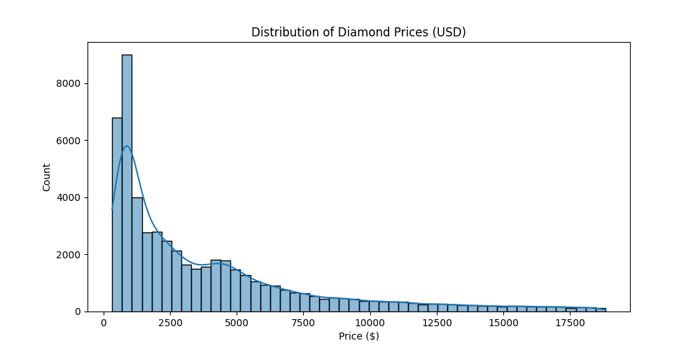
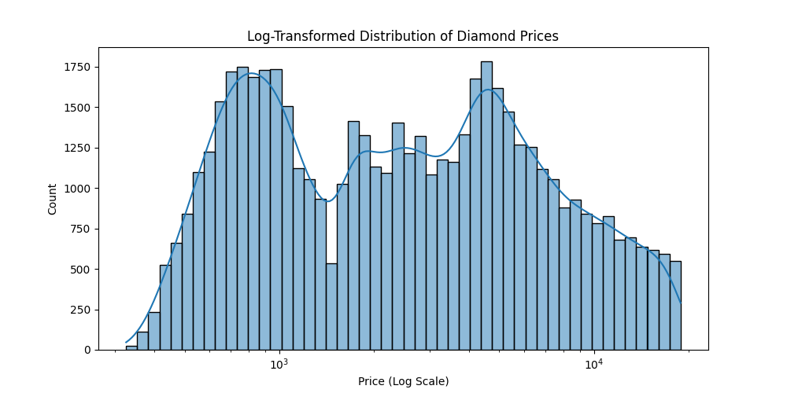
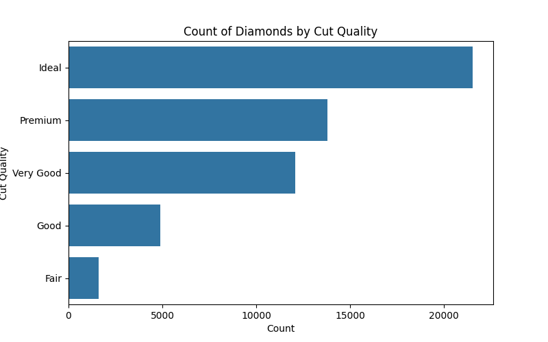
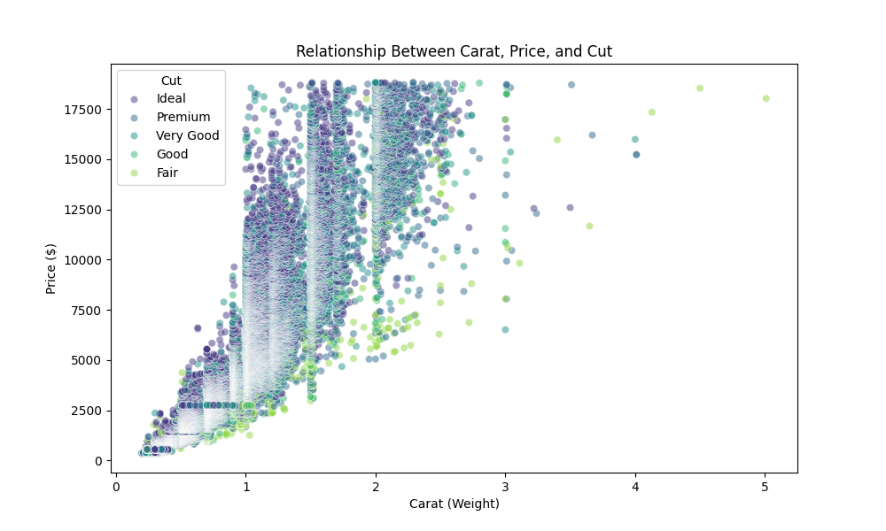
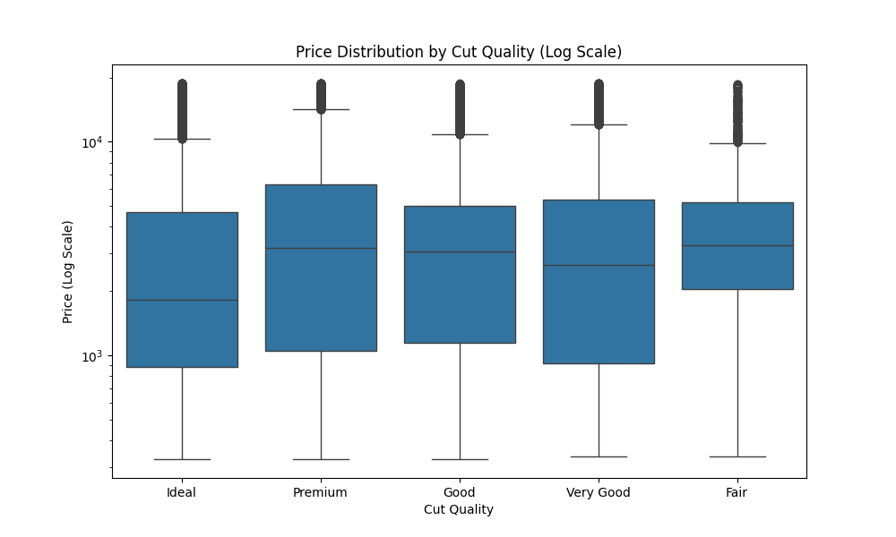

# Project-5-Data-Visualization-with-Diamond-Data
Project 5: Data Visualization with Diamond Data

Objective

The goal is to load the well-known "Diamonds" dataset, and use Matplotlib and Seaborn to perform univariate and bivariate explorations of key features like price, carat, and cut.

## Installation

To run this project, you need to have Python installed along with the following libraries:

```bash
pip install pandas seaborn matplotlib
```

## Usage

Run the analysis script to load the data and generate visualizations:

```bash
python analyze_diamonds.py
```

## Results

The script generates the following visualizations:

### Price Distribution


### Log-Transformed Price Distribution


### Cut Quality Distribution


### Carat vs Price Scatter Plot


### Price Distribution by Cut Quality

